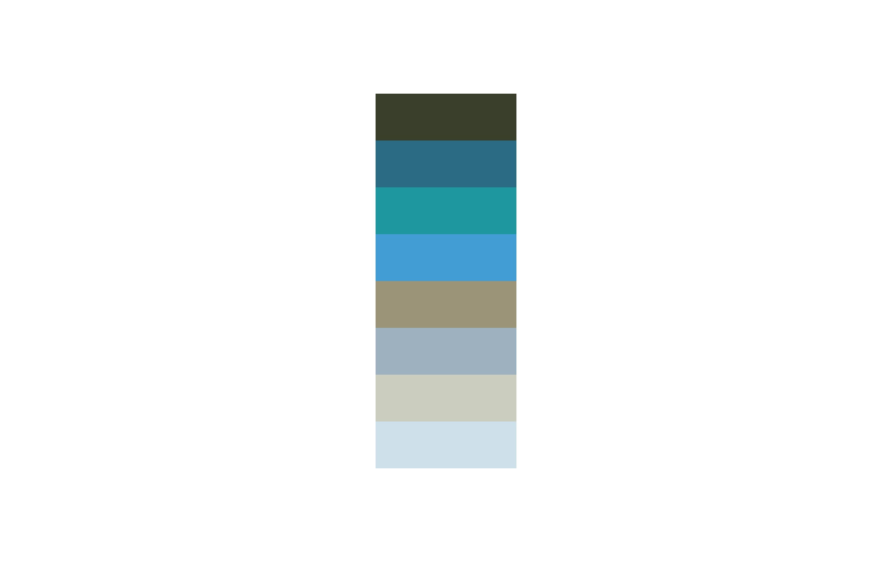

# Median cut algorithm (multiple images implementation)

Median cut is an algorithm to sort data of an arbitrary number of dimensions into series of sets by recursively cutting each set of data at the median point along the longest dimension.

Median cut is typically used for color quantization (a process of reduction of the number of colors used by an image).

This code implements the median cut algorithm in order to use it over a dataset of images.

## Usage
```python3 main.py -i images -o results -c 3```

Where:
- ```images``` is the input image folder path
- ```results``` is and existing folder path to save images to
- ```3``` is the number of colors needed in the power of 2 (in this case $2^3$)

## Example
The following test has been made over a small dataset of 7 beach images, requesting to generate a palette of $2^3$ colors.

Original image:


Color-quantizied image:


Generated palette:


## Side notes
The process of finding a small subset of representative colors is important in the context of multimedia databases. 

On a query request, in order to compare two images in the color space, their relative color histograms could be used. In this context, a color histogram should contain a meaningful representative colors. 

The median cut algorithm provides a simple hint to find them. 

## Reference and inspiration
- https://github.com/muthuspark/ml_research/blob/master/median%20cut%20color%20quantization.ipynb
- Candan KS, Sapino ML. Data Management for Multimedia Retrieval. Cambridge University Press; 2010.
